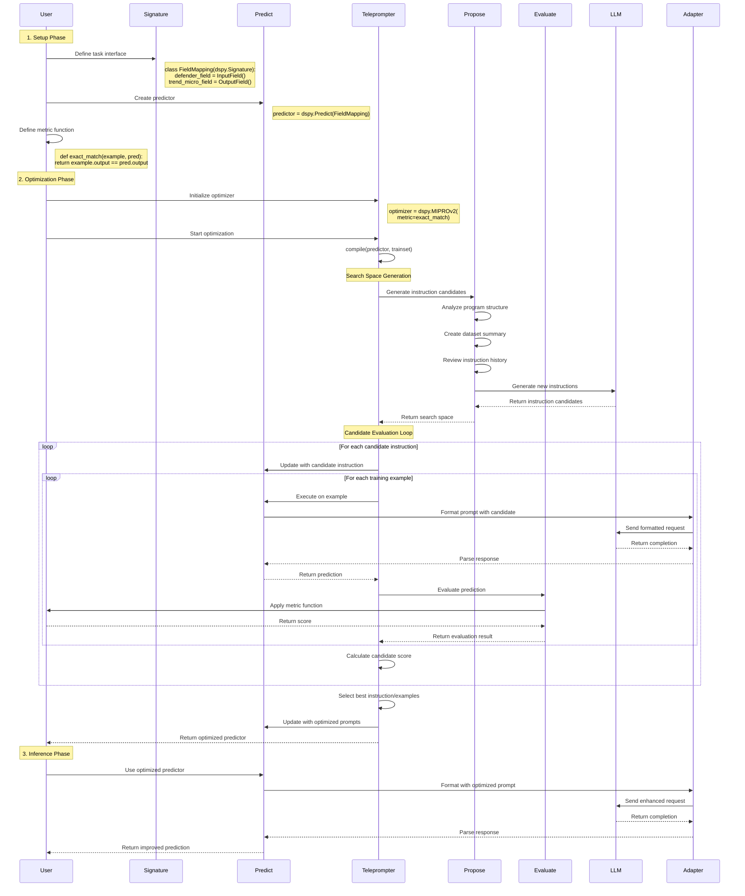
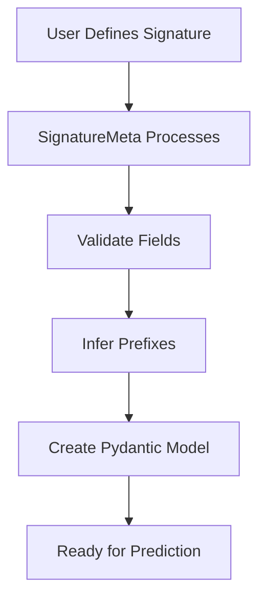
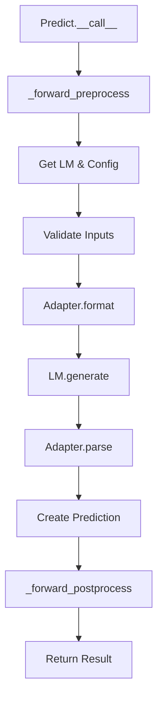
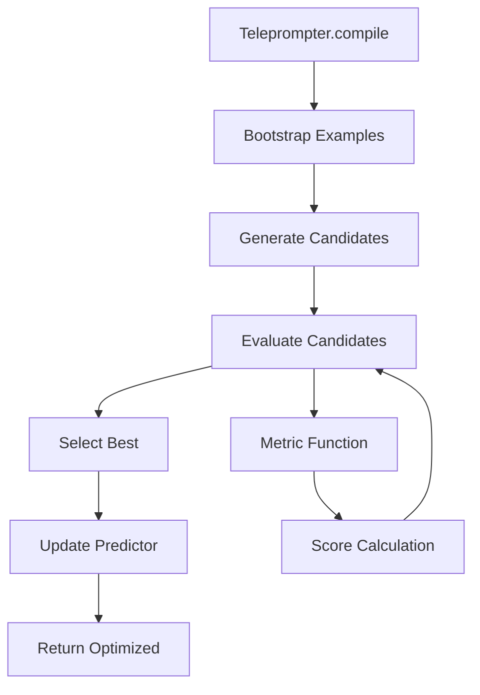
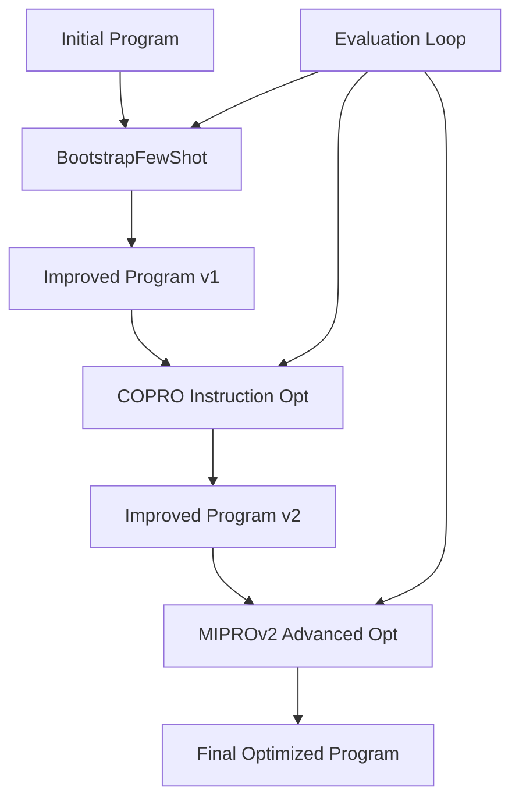

# STUDY_003: DSPy Architecture and Optimization Workflow

## Overview

This study provides a high-level architectural overview of DSPy's core components and illustrates the end-to-end optimization workflow through sequence diagrams and component analysis.

## DSPy Folder Structure Analysis

### Core Architecture Components

```
dspy/
├── signatures/          # Input/Output Interface Definitions
├── predict/            # Execution Modules (Predictors)
├── evaluate/           # Evaluation Framework
├── teleprompt/         # Optimization Strategies (Teleprompters)
├── propose/            # Instruction/Demo Proposal
├── primitives/         # Core Data Structures
├── clients/            # LLM Interface Layer
├── adapters/           # Format Conversion Layer
└── utils/              # Supporting Utilities
```

### 1. **Signatures** - Interface Definition Layer
**Purpose**: Define input/output contracts for LLM tasks

| Component | Responsibility |
|-----------|----------------|
| `Signature` | Base class for defining task interfaces |
| `InputField` | Defines input parameters with descriptions |
| `OutputField` | Defines expected outputs with constraints |
| `make_signature()` | Dynamic signature creation from strings |

**Example**:
```python
class FieldMapping(dspy.Signature):
    """Map Microsoft Defender fields to Trend Micro fields."""
    defender_field = dspy.InputField()
    trend_micro_field = dspy.OutputField()
```

### 2. **Predict** - Execution Layer
**Purpose**: Execute LLM calls using signatures

| Component | Responsibility |
|-----------|----------------|
| `Predict` | Core predictor that executes signatures |
| `ChainOfThought` | Adds reasoning steps to predictions |
| `ReAct` | Tool-using agent pattern |
| `ProgramOfThought` | Code generation and execution |
| `Parallel` | Parallel execution of multiple predictors |

**Example**:
```python
predictor = dspy.Predict(FieldMapping)
result = predictor(defender_field="SHA256")
```

### 3. **Evaluate** - Assessment Framework
**Purpose**: Measure program performance against metrics

| Component | Responsibility |
|-----------|----------------|
| `Evaluate` | Main evaluation orchestrator |
| `EM` (Exact Match) | Built-in exact match metric |
| `SemanticF1` | Semantic similarity metric |
| `answer_exact_match` | Answer-specific matching |

**Example**:
```python
def exact_match(example, pred, trace=None):
    return example.trend_micro_field.lower() == pred.trend_micro_field.lower()

evaluator = dspy.Evaluate(devset=test_data, metric=exact_match)
```

### 4. **Teleprompt** - Optimization Engine
**Purpose**: Improve program performance through various strategies

| Strategy Category | Components |
|------------------|------------|
| **Few-shot** | `LabeledFewShot`, `BootstrapFewShot` |
| **Instruction** | `COPRO`, `MIPROv2`, `SignatureOptimizer` |
| **Search** | `BootstrapFewShotWithRandomSearch`, `SIMBA` |
| **Fine-tuning** | `BootstrapFinetune`, `GRPO` |
| **Meta** | `BetterTogether`, `Ensemble` |

### 5. **Propose** - Content Generation
**Purpose**: Generate instructions and demonstrations

| Component | Responsibility |
|-----------|----------------|
| `GroundedProposer` | Generate contextually grounded proposals |
| `dataset_summary_generator` | Create dataset summaries for optimization |

### 6. **Primitives** - Core Data Structures
**Purpose**: Fundamental building blocks

| Component | Responsibility |
|-----------|----------------|
| `Example` | Training/test data container |
| `Prediction` | LLM output container |
| `Module` | Base class for all DSPy components |
| `BaseModule` | Abstract base for modules |

## High-Level Optimization Workflow

### User's Assumption Confirmed ✅

**Yes, your assumption is correct!** The workflow is:
1. **User defines signature** (input/output interface)
2. **User provides metric** (evaluation function)
3. **DSPy orchestrates optimization** automatically

## End-to-End Optimization Sequence Diagram



## Detailed Component Interaction Flow

### 1. Signature Definition Flow


### 2. Prediction Execution Flow


### 3. Optimization Strategy Flow


## Integration Workflow: The Complete Picture

### Phase 1: Definition
```python
# 1. User defines the task interface
class TaskSignature(dspy.Signature):
    """Task description"""
    input_field = dspy.InputField(desc="Input description")
    output_field = dspy.OutputField(desc="Output description")

# 2. User creates predictor
predictor = dspy.Predict(TaskSignature)

# 3. User defines evaluation metric
def task_metric(example, prediction, trace=None):
    return example.output_field == prediction.output_field
```

### Phase 2: Optimization
```python
# 4. User selects optimization strategy
optimizer = dspy.BootstrapFewShot(
    metric=task_metric,
    max_bootstrapped_demos=5
)

# 5. DSPy orchestrates optimization
optimized_predictor = optimizer.compile(
    student=predictor,
    trainset=training_examples
)
```

### Phase 3: Execution
```python
# 6. User uses optimized predictor
result = optimized_predictor(input_field="test input")
print(result.output_field)
```

## Key Architectural Principles

### 1. **Separation of Concerns**
- **Signatures**: Define WHAT the task is
- **Predictors**: Define HOW to execute
- **Optimizers**: Define HOW to improve
- **Evaluators**: Define HOW to measure

### 2. **Modular Design**
- Each component is independently replaceable
- Consistent interfaces across all layers
- Plug-and-play optimization strategies

### 3. **Declarative Programming**
- Users declare intent, not implementation
- DSPy handles the complex optimization logic
- High-level abstractions hide LLM complexities

### 4. **Composability**
- Components can be combined and nested
- Complex workflows built from simple parts
- Reusable patterns across different tasks

## Optimization Strategy Selection Matrix

| Task Complexity | Data Size | Resource Budget | Recommended Strategy |
|-----------------|-----------|-----------------|---------------------|
| **Simple** | Small | Low | `LabeledFewShot` |
| **Medium** | Medium | Medium | `BootstrapFewShot` |
| **Complex** | Large | High | `MIPROv2` |
| **Specialized** | Any | High | `BetterTogether` |

## Advanced Workflow: Multi-Stage Optimization



## Error Handling and Robustness

### Built-in Resilience
- **Adapter Pattern**: Handles different LLM response formats
- **Error Recovery**: Graceful handling of parsing failures
- **Parallel Execution**: Fault tolerance in multi-threaded evaluation
- **Metric Validation**: Ensures evaluation consistency

### Debugging Support
- **Trace Collection**: Complete execution history
- **State Serialization**: Save/load optimized programs
- **Progress Monitoring**: Real-time optimization feedback
- **Error Reporting**: Detailed failure analysis

## Conclusion

DSPy's architecture elegantly separates the concerns of task definition, execution, evaluation, and optimization. The workflow confirms your assumption: **users define signatures and metrics, then DSPy automatically orchestrates the optimization process** through its modular, plug-and-play architecture.

The key insight is that DSPy abstracts away the complexity of prompt engineering while providing powerful optimization capabilities through its teleprompter system. Users focus on defining what they want (signatures) and how to measure success (metrics), while DSPy handles the how of optimization.

This architecture enables rapid experimentation with different optimization strategies while maintaining consistent interfaces and evaluation frameworks across all components.
